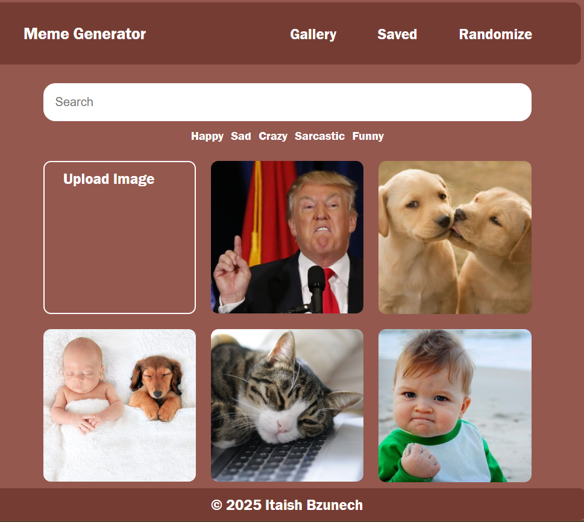

# Memes Creator

A responsive meme generator web app built with **HTML5 Canvas**, CSS, and JavaScript.

## 🎥 Demo

## 🧰 Features

- Choose/upload an image to use as the meme background.  
- Add custom text (top and/or bottom).  
- Style the text (font size, color, positioning).  
- Share/save the final meme image.
-  **Drag & Drop**: Move the text freely across the canvas.  
- Fully **responsive design** – works smoothly on desktop, tablet, and mobile devices.  

## 📂 Project Structure

- `index.html` — Main page with UI for image selection and text input.  
- `css/` — Stylesheet(s) for layout and styling.  
- `js/` — JavaScript logic (e.g. rendering text over image, handling export).  
- `img/` — Sample images/backgrounds.

  
## ⚙️ Technologies Used

- **HTML5 Canvas**  
- Vanilla JavaScript  
- CSS3 (Responsive Design)

## 🌐 Live Demo

Check out the live version here: [Meme Generator](https://itaish-bzu.github.io/Memes/)

